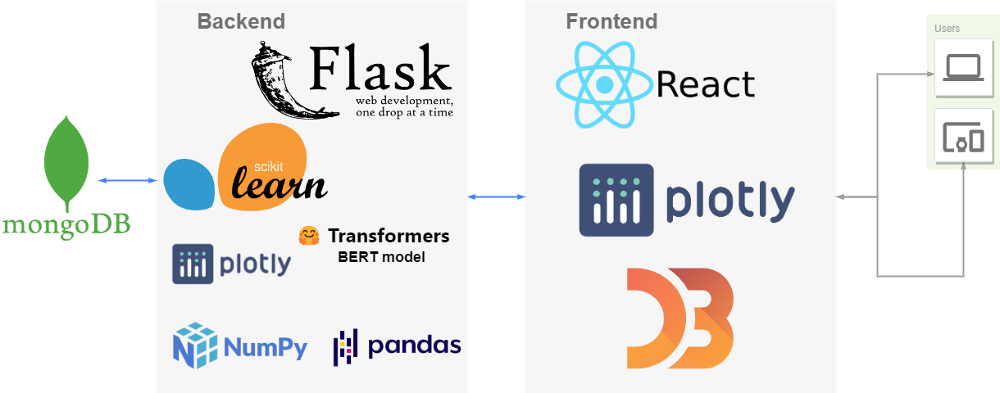
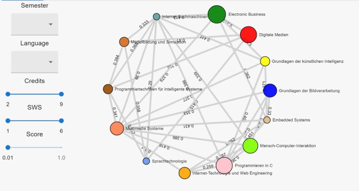
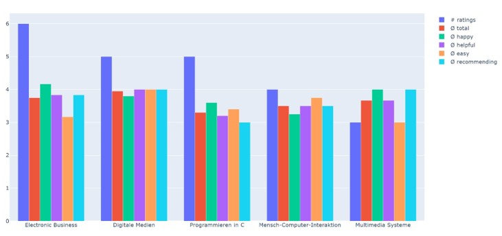
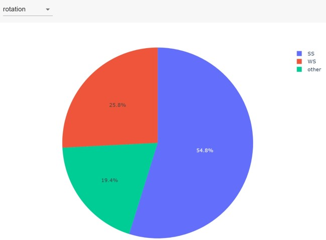

# LecRec - Lecture Recommender

<table>
  <tr>
    <th style="width:100px"></th>
    <th>LecRec is a web application built for the BAI and MAI students of  the university Duisburg-Essen to help them to choose the elective courses based on the similarity between the courses, based on the student ratings or based on the course, that are been taken usually together.</th>
  </tr>
</table>

## Architecture



## How to run the project:

### Back-End

Back-end is in the **backend** folder.

```bash
cd ./backend/
```

**requirements**:

```bash
pip install -r requirements.txt
```

**run backend**:

```bash
python .\src\app.py
```

### Front-End

Got to frontend folder and open cmd in this directory and run

```bash
cd ./frontend/
```

**node modules**:

```bash
npm install
```

**run frontend**:

```bash
npm start
```

## Visualization

### Network Graph



### Top rating Graph



### Rotation/Language Graph



## Demo:

[Demo](https://youtu.be/ipmy44q5W9c)

[LIVE-DEMO](https://lecrec.graystone-2d472ff8.germanywestcentral.azurecontainerapps.io/)

## Collaborators

- Huthayfa Ghunaim
- Anshuman Sinha
- Mahsa Alizadeh
- Ali Elhag
- Robert Fiedler
